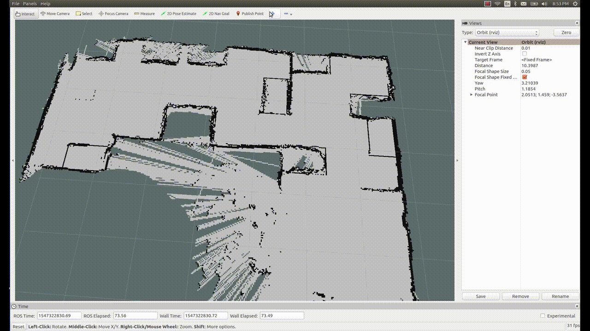
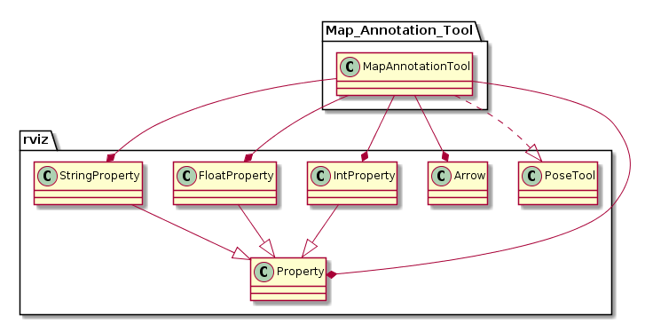

[](https://travis-ci.org/Sushant-Chavan/map_annotation_tool)

## Map Annotation Tool
The Map Annotation Tool eases annotating simulated robot navigation maps with goal poses, by allowing storage, retrieval, and editing of navigational goal markers.

Authors:
1. Sushant Vijay Chavan
2. Ahmed Faisal Abdelrahman

The map annotation tool facilitates annotating navigation maps efficiently and flexibly. It includes the following functionalities:
- Setting and saving robot goal pose arrow markers on the map by clicking and dragging to set (x, y, theta)
- Editing set goal pose values from a drop-down menu
- Renaming goal pose markers
- Resizing the markers
- Reloading previously saved goal poses

The following GIF demonstrates the map annotation tool being used to add and update a new pose on RViz:




### Installation
Installing the plugin requires simply cloning this repository in the catkin workspace and building. For a workspace named catkin_ws in the root directory:
```sh
$ cd ~/catkin_ws/src/
$ git clone git@github.com:b-it-bots/map_annotation_tool.git
$ catkin_make or catkin build
```

### Instructions
#### Using the Map Annotation tool
The tool can be used by following these steps:
##### Initializing the tool:
- Having started RViz, click on the "Add a new tool" button (+) on the top panel
- In the pop-up window, double-click on the MapAnnotationTool. At this point, any goals saved to the file will appear as markers on the map (see instructions for file path settings below)
- Open the "Tool Properties" panel from the "Panels" tab. The panel contains the Map Annotation Field drop-down menu, from which navigation goals can be edited.
##### Placing navigational goals:
- To place a new goal marker, click on "Map Annotation Tool" on the top panel.
- On the map, click on the desired location on the map, and while holding the left mouse button, drag the cursor around to set the desired orientation. Releasing the left mouse button sets the new navigation pose.
##### Editing poses:
- To change the size of the pose markers, adjust the value in the "Marker Size" field.
- To change goal properties, expand the "Marker Container" drop-down list, and expand the entry of the goal pose to be edited.
- To change the name, position in x or y, or orientation, edit the respective field.


#### Setting the path for the navigation goals file
The navigational poses saved to and retrieved to a YAML file (navigation_goals.yaml), and stored in the following path in the catkin workspace:
```
~/catkin_ws/src/mas_common_robotics/mcr_environments/mcr_default_env_config/[ROBOT_ENV]
```
The containing folder is named according to the ROBOT_ENV environment variable. In order to read from the file and write to it correctly, this must be correctly set before using the tool.


### Architecture
